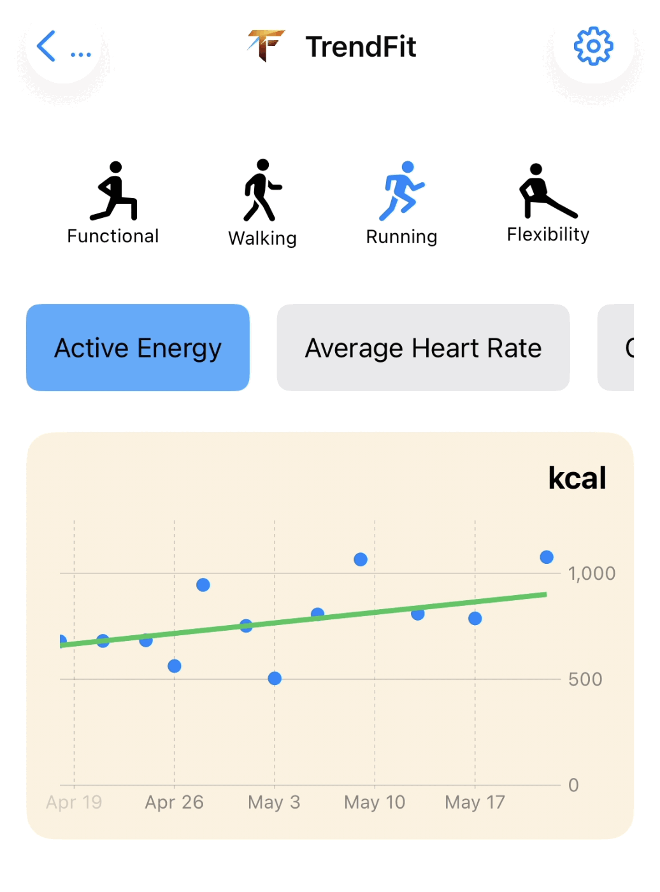
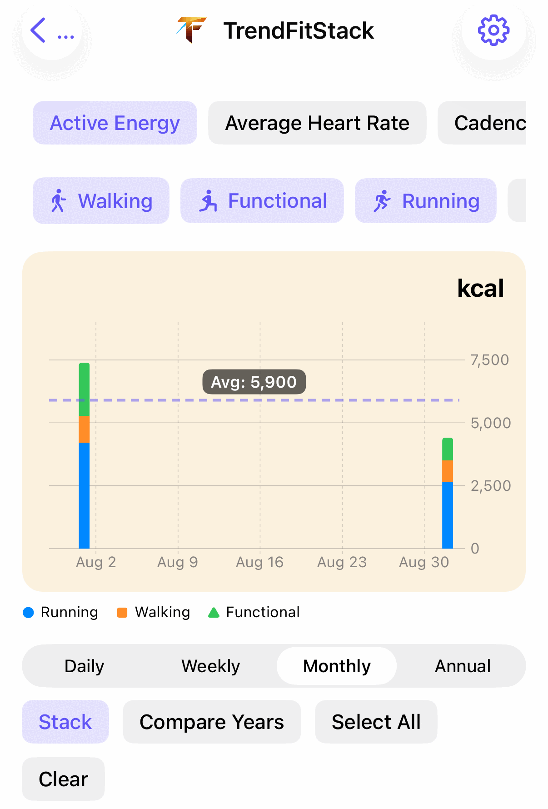
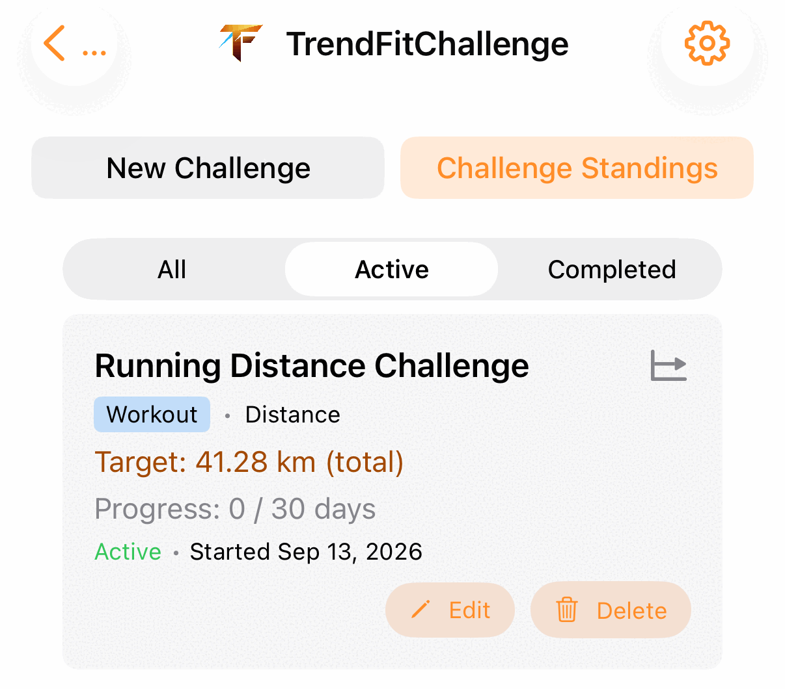

# TrendFit Website

Official site for **TrendFit** — a free, privacy-first iOS app that turns your Apple Health workout data into clear, visual trend insights.

🌐 **Live site:** [www.trendfitapp.com](https://www.trendfitapp.com)
📱 **App Store:** [Download TrendFit](https://apps.apple.com/ca/app/trendfit/id6751863796)

## The App

TrendFit (v1.5) analyzes your workouts entirely on-device — nothing is ever uploaded. Pick a workout and a metric, and a color-coded trend line shows at a glance whether you're improving.

| TrendFit | TrendFitStack | TrendFit Challenge |
|:---:|:---:|:---:|
|  |  |  |
| Trend lines for any workout and metric, with zoomable charts | Compare workouts and metrics side by side | Set goals, track progress, get notified |

## The Site

A static GitHub Pages site — vanilla HTML, CSS, and JavaScript. No build step, no dependencies. Pushes to `main` deploy automatically.

- **Pages:** home dashboard, FAQ, announcements, privacy policy, terms of service
- **Content:** FAQ, announcements, and policies render from JSON in `data/`
- **Styling:** single stylesheet with a semantic design-token system and automatic dark/light themes
- **Local dev:** serve the folder with any static server (e.g. VS Code Live Server)

See [CLAUDE.md](CLAUDE.md) for the full development guide and [CHANGELOG.md](CHANGELOG.md) for site history.

## Contact

Questions or feedback: [trendfitapp@gmail.com](mailto:trendfitapp@gmail.com)

---

© 2026 TrendFit. All rights reserved.
