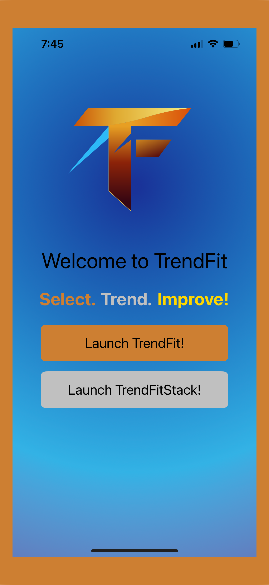
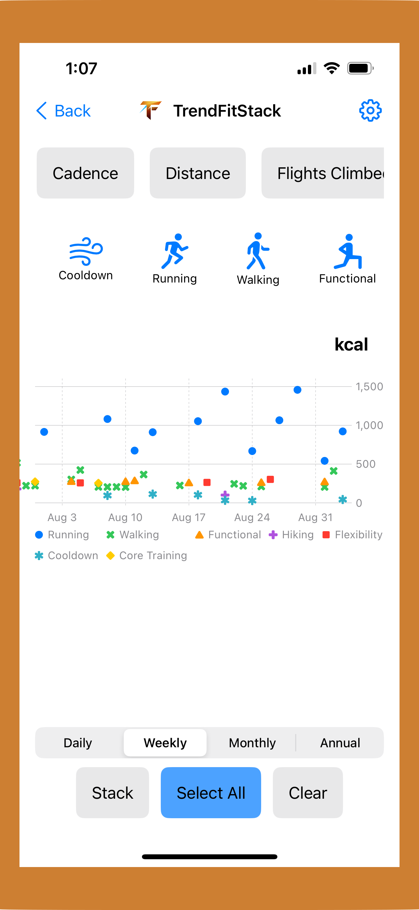
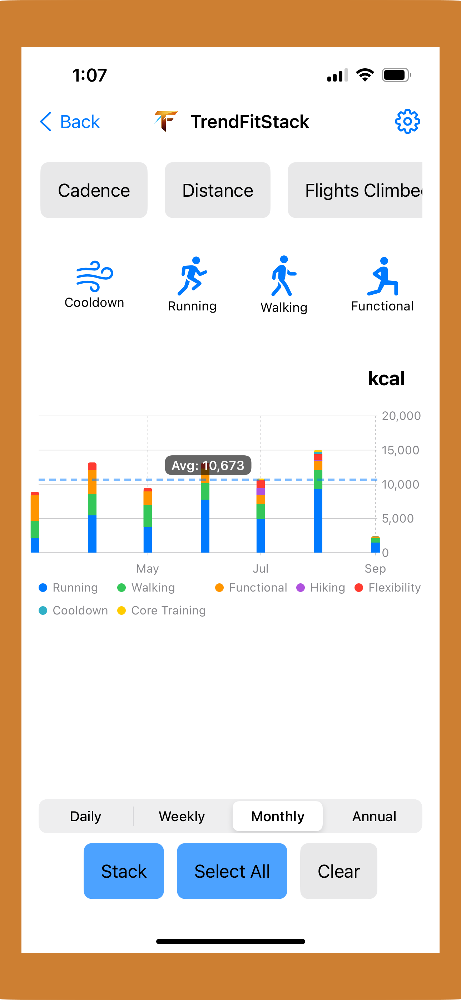
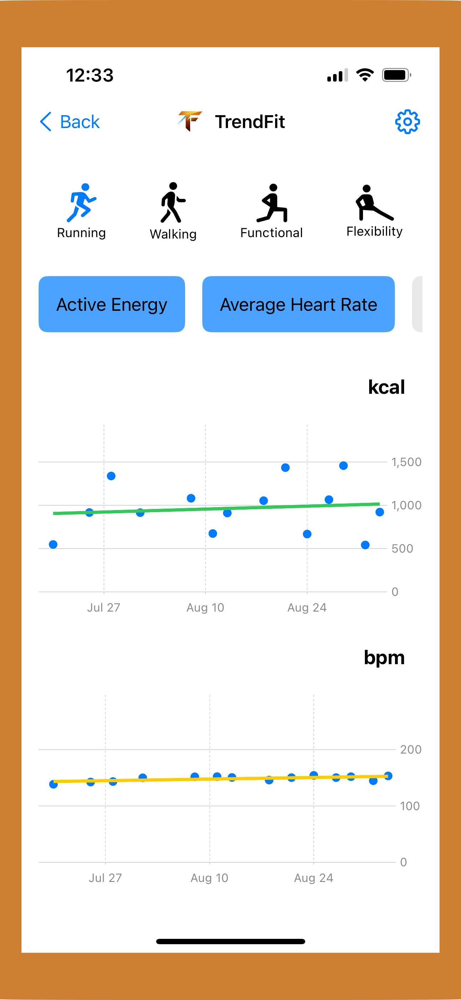

# TrendFit Website

Official website for TrendFit - A fitness tracking app for iOS that analyzes workout trends from Apple Health data.

🌐 **Live Site:** [trendfitapp.com](https://trendfitapp.com)

📱 **App Store:** [Download TrendFit](https://apps.apple.com/ca/app/trendfit/id6751863796)

## About TrendFit

TrendFit is a privacy-first iOS fitness app that helps users understand your workout patterns and progress over time. By analyzing Apple Health data directly on your device, TrendFit provides fast, insightful visualizations without compromising your privacy.

**Select. Trend. Improve!**

### Key Features

- **Privacy-First:** All data processing happens on-device using Apple Health data
- **Zoomable Charts:** Interactive visualizations to explore your fitness trends
- **Trend Analysis:** Track slopes and patterns in your workout data over time with scatter plots and trend lines
- **Stacked Insights:** View multiple metrics together for comprehensive analysis
- **Multiple Workout Types:** Track Running, Walking, Flexibility, Functional training, Hiking, Core Training, and more
- **Fast & Efficient:** Quick insights without unnecessary complexity

## App Screenshots

### Scatter Plot View - Track Individual Workouts

View individual workout data points with trend lines showing your progress over time. Perfect for tracking calories burned and heart rate patterns.

### Stacked Chart View - See the Big Picture

Compare multiple workout types side-by-side with color-coded stacked bar charts. Easily see which activities contribute most to your weekly or monthly totals.

### TrendFitStack - Advanced Multi-Metric Analysis

Analyze multiple metrics simultaneously with TrendFitStack. View Active Energy and Average Heart Rate trends across different workout types with both scatter and stacked visualizations.

## Website Structure

This repository contains the marketing website for TrendFit, built with HTML, CSS, and JavaScript.

### Pages

- **Home** (`index.html`) - Main landing page with app overview
- **Features** (`features.html`) - Detailed feature descriptions
- **Community** (`community.html`) - Community information and engagement
- **Contact** - Contact information for support and inquiries

## Technologies Used

- HTML5
- CSS3
- JavaScript
- Responsive design for mobile and desktop

## Development

This is a static website hosted on GitHub Pages. The site serves as the web presence for the TrendFit iOS app.

## About the Developer

Created by Curtis Williams, a retired mechanical engineer exploring app development. TrendFit represents a journey from engineering to software development, combining technical expertise with a passion for fitness and data visualization.

## Links

- [TrendFit on the App Store](https://apps.apple.com/ca/app/trendfit/id6751863796)
- [Visit Website](https://trendfitapp.com)
- [Contact](mailto:contact@trendfitapp.com)

## License

© 2025 TrendFit. All rights reserved.

---

*Track long-term fitness trends with zoomable charts, slopes, and stacked insights.*
